“C++: 31 hours long video of freecodecamp”

Features: 

Supports data abstruction, means Data abstraction is a fundamental concept in computer science and software engineering that involves hiding the implementation details of data types and exposing only the essential features or behaviour to the outside world. Data abstraction is a powerful concept that facilitates the design, implementation, and maintenance of complex software systems by providing clear interfaces, encapsulating implementation details, promoting modularity, and supporting information hiding.

----------------------------- 

Statement: A statement is a basic unit of computation in a C++ program. Ends with a semicolon(;).

They are executed from top to bottom when program is run. 

------------------------

---------------------x--------------------

input For Space separated word 

Variable: A piece of memory that used to store specific type of data.

Number System representation:

*** Modifier like signed, unsigned used integral data type as decimal number/ whole number. Can’t use for float, double(2.0, 2.5).

Float and Double:

**Precision includes digits before decimal point(.). 12547.325-> 12547 included in the precision.

For Float: 12345.6789-> 89will be garbage value. Cause precision 7 for Float. May print like: 12345.6725

** float a=123456789-> 89 will b garbage value. May print like: 12345.6745

Floating point number memory representation is not similar to decimal number. It explained in IEEE_754 -> IEEE_754-> Press ctrl & Click

cout<<setprecision(20);

If we not set precision, the default precision will be 6 digits.(Total digits. Not after decimal point)

if we use “fixed” the with set precision(4), precision will be 4 after decimal point. Above a=12.1234;(ans)

But not using “fixed” precision will be 4 for total digits. Above a=12.12;(ans)

used for set precision. Library> #include<iomanip>

suffixes(like f, L): u // unsigned

ul // unsigned long

ll // long long

-------------------------------------xxx--------------------------------

**Booleans occupy 1byte/8bits in memory.

bool x=true; // or bool x=1;

bool y=false; // or bool y=0;

cout<<boolalpha; //used for printf true/false instead of 0/1

cout<<x<<” ”<<y;

will print true, false.

----------------------------------------

Character:

----------------x--------------

** 31/10 means how many times 10 is gonna fit in 31. so ans is 3.

* Relation Operator: > ,< , >=, <=

* Logical Operator: &&, ||, !

-------------x-----------

Manipulator: https://en.cppreference.com/w/cpp/io/manip //for more

* std:flush: when we print something, it does not go directly to the terminal. It store somewhere called “buffer”. When buffer is full/ complete it goes to terminal. If use std:flush data directly goes to console/terminal instead of goes to buffer.

*setw() : set width

cout<<right; // printf from right. Left for left alignment

cout<<setfill(‘-’) // blank space fill with ‘-’

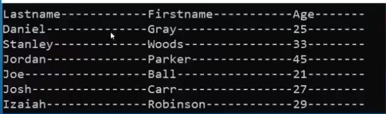

*for finding max min numeric number limits data type can hold.

Need this> #include<limits> 

https://en.cppreference.com/w/cpp/types/numeric_limits

--------------x------------

#include<cmath> : abs(), pow(), ceil(), log(), sqrt(), sin(), tan() etc https://en.cppreference.com/w/cpp/header/cmath 

for log(): log(10) means loge(10). So have to fix the base as log10(10). E=2.71..

* round(): 3.5 will make 4, and 3.49 will make 3.

------------------------------- 

if we take data type less than 4 byte and perform arithmatic operation compiler automatically convert it to 4 byte. This behavior also present on other operator like bitwise operator.(>>, <<) 

-----------------

flow control: if else, switch, ternary operator.

*Switch: if we not use “Break”, the case which match, after that all case will execute and print every case value.

* we can use int, char , double, enum etc but not string as case.

--------------------------------------

* If we use “const” before array. We cant modify array elements.

* a[ ]={2,3,7,5,2,3}; size(a) return the size of array. /Or sizeof(a)/sizeof(a[0]);

---------x-------

Enum: An enum is a special type that represents a group of constants (unchangeable values).

To create an enum, use the enum keyword, followed by the name of the enum, and separate the enum items with a comma.

Enum is short for "enumerations", which means "specifically listed".

To access the enum, you must create a variable of it.

Inside the main() method, specify the enum keyword, followed by the name of the enum (Level) and then the name of the enum variable (myVar in this example):

By default, the first item (LOW) has the value 0, the second (MEDIUM) has the value 1, etc.

If you now try to print myVar, it will output 1, which represents MEDIUM:

As you know, the first item of an enum has the value 0. The second has the value 1, and so on. To make more sense of the values, you can easily change them:

Note that if you assign a value to one specific item, the next items will update their numbers accordingly:

Example:

#### Why And When To Use Enums?

Enums are used to give names to constants, which makes the code easier to read and maintain. Use enums when you have values that you know aren't going to change, like month days, days, colours, deck of cards, etc.

Pointer

Pointer is special kind of variable.

int* int_num{}; or int* int_num; // will point to a integer type variable //initialise with null  // pointer(nulptr) 

double* frac_num{}; // will point to a double type variable

int * int_num{}; // this initialisation with {} is going to initialise with special address means it is not //pointing any variable. Means initialize with nullptr

int * int_num{nullptr}; // this pointer not pointer anywhere

** pointer of int, double, char etc all are same size. Cause they only store address.

Char *ptr{“Hello world”}; // Pointer will point to 1st character. Some compiler will not compile(MSVC). GCC will give warning and compile. A whole string is assigning to char type pointer. See:10:17:00

Cout<<ptr; // will print whole string.

Cout<<*ptr;// print 1st character ‘H’;

*ptr=’B’;// this may give error. Cause compiler will think it as const char array.

If want to modify. Don’t use character pointer, use array like: char msg[10]==”Hello world”;

or use const char *ptr{“Hello world”}; // no warning. Can’t modify also.

Dereferencing pointer: reading something(value) on the address of the pointer. Cout<<*ptr;

string with pointer: char* p_msg= “Hello World!”; // the pointer will point to the 1st character of string

*this will compile with warning. Use const char* p_msg= “Hello World!”;

printf p_msg will print whole string. But using dereferencing will print 1st character(*p_msg).

*** without const it gives warning/refuse to compile cause compiler is going to convert string into char array of constant char. What we are using is points to that is not a const char pointer. So pointer here might be used to try or modify data. That’s why it refuse unless using const. 

Check at 10:17min

int *ptr;// contain junk address

int a=12;

*ptr=&a;

uninitialized pointer contain junk address. Assigning a value to it(*ptr=12)May cause error. Could be point to a memory which is used by OS. May cause disaster. 

Use this: int a; int *ptr=&a;

Memory Map

When we run a program it runs on RAM. Various program of OS or other is running on memory.

This process thinks it own 0~2N amount of memory which is virtual memory.

When we run a program it is going to go through a CPU section called memory management unit(MMU).

Part that are likely not to be used are discarded from the RAM.

MMU really does is, helps us mapping between the memory map in ur program and the real thing we have in RAM.

If we run few program, they are going to go through MMU and MMU is going assign them real section on RAM

* Since program thinks it 2n -1 memory, The MMU is going to transform between the idea the program has and the RAM we have(assigned memory by MMU).

* The memory map/Structure of program is standard format defined by OS. That’s why we can’t run directly window program on Linux.

*Memory map is divided into a lot parts

* STACK: Local variable stores on stack section.

* print, statement, function calls others store on stack section.

* TEXT:Actual binary load on Text so that CPU can execute it.

* HEAP:Additional memory when we run out of stack memory also to make things better for program, Used for run time.

Dynamic Memory Allocation

2nd point- full Control: when declare a variable a=23; in stack it remove when scope is over. Developer doesn’t have full control. But in heap developer have full control when a variable comes to work and dies.

>> 10:41 min

*set up a pointer which point to heap memory.

After initializing a pointer with nullptr. When p_number4=new int execute the OS is allocate a memory on heap. Variables are usually stores on stack section. It removes when variable containing scope will over. But if we allocate a memory on heap by “p_number4=new int;” . This memory will live though its scope is over. It will stay until return it to operating system. To return:

Use ‘delete’ to return memory to the operating system. After return reset pointer to ‘nullptr’ is good to make it clear that no valid data pointer is pointing.

* Using ‘delete’ remove the allocated heap memory which is pointed. Not the pointer. If pointing to ‘nullptr’, delete will do nothing.

*** Always remember to release memory.

*Dangling Pointer: A pointer that doesn’t point to a valid memory address. Trying to dereferencing and using a dangling pointer will results in undefined behaviour. 

How dangling pointer create:

1. Uninitialized pointer.

2. Delete pointer

3. Multiple pointer points to same memory.

Solution:

1. Initialize pointer. Either with valid address or nullptr.

2. Reset pointer after delete.(Either with valid address or nullptr.)

3. For multiple pointer point to same address, make sure master pointer is clear/ reset.

*** Always check if pointer is nullptr or not by if-else.

‘New’ fails:

When allocating an array with pointer with huge size(1000000000000000000). It may fails and program can crash. We can use exception mechanism or ‘nothrow’ to prevent crashing.

Both allocation (with for loop or without) fail.

* Solve with ‘exception mechanism’:

With ‘exception’ we can catch the problem. What is called ‘handle’ in the problem. Suppose we are going to set up color and color fails. UI(interface) may show black and white. But program will keep running “what()” function will show the error.

*with ‘nothrow’: If “new” fails, we are going to get “nullptr” stored.

For clear understanding see 

https://www.youtube.com/watch?v=uoCuMTzD9AE&list=PLgH5QX0i9K3q0ZKeXtF--CZ0PdH1sSbYL&index=90 // anisul islam lecture 92. Exception handling

NULL pointer safety:

check if null or not.

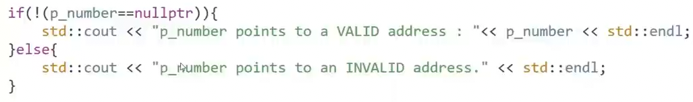

Or,

Pointer address implicitly converted into boolean. (null==0).

* After use delete set pointer to nullptr for safety.

-----------------x--------------

Memory Leaks:

while 2nd allocation, pointer changes its pointing location to 2nd memory. Don’t have access of 1st memory(55).

Should delete 1st then allocate 2nd.

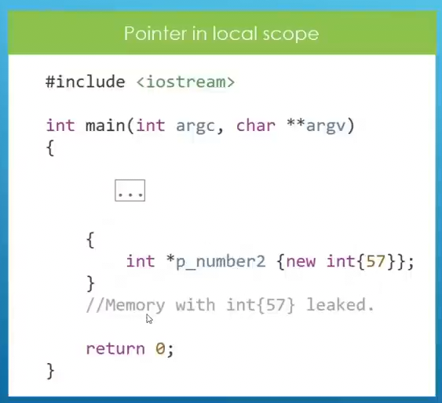

After local scope is over, pointer is gonna die, but allocated memory will remain and loose access.

These memory leaks may causes program crash.

Dynamic array: Array stores on the heap.

Release Memory:

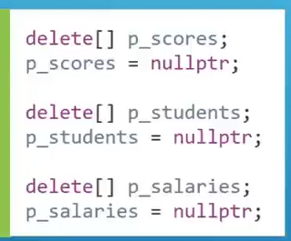

Dynamic arrays are created at run time not compile time.

Explanation:

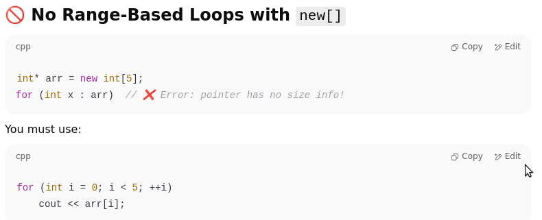

Reference: A reference is an alias (another name) for an existing variable. It does not create a new variable or occupy memory, it just gives another way to access the same memory. Doesn’t hold addresses as pointer.

If we change reference value or variable value, both contribute same changes.

** “&ref” and “&s” both has same memory address.

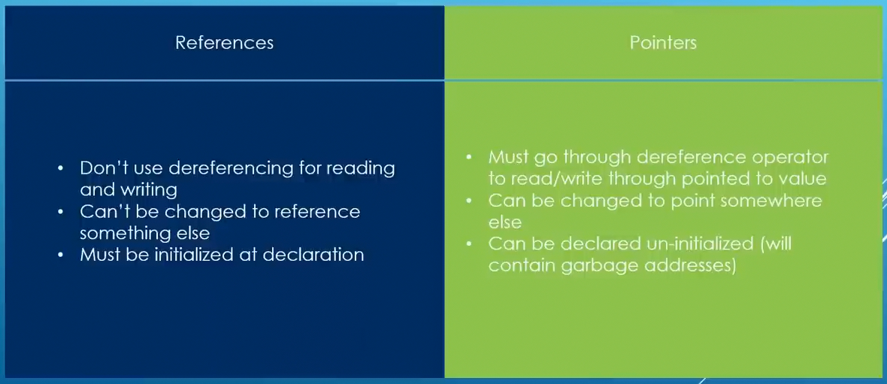

Reassign a Pointer to others variable, but reference can’t.

Here ‘S and ref’ value will changes to 12.

Use case: *if want to modify original variable inside a function. This save memories.

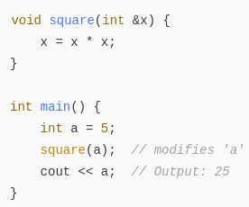

* Return reference by function to a local or global variable.

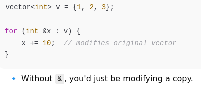

* Using “const” before reference makes the variable unchangeable. This constant only applies to reference. Not variable. Can’t changes variable value with “const reference”. But variable itself can changes its value.

Value will changes to 12.

-------------------------x-------------------

*** size(), sizeof() function return the size. But for character array it includes ‘null’ . But for string size() don’t count null.

*** strlen() is used for character array. Not for string.

char *a=”asdf”; // this is string literal. Not modifiable. 

Char a[]=”asdf”; // this is character array. Modifiable. Use stack memory.

Using “const” is safe in string literal.

***String literal is actually a character array. When we assign it to “const char * ”, it automatically converts into a pointer to 1st element. String has not fixed amount of memory, cause it internally implemented as a class and it stores its data as const char pointer.

Const char *msg=”Hello I am here.”;

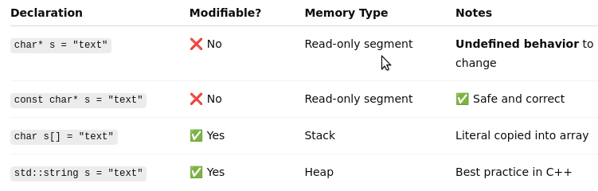

Character array lives on read only memory. Can’t modify.

----------x--------

swap 2 number.

1. a=a+b; b=a-b; a=a-b;

2. a=a^b; b=a^b; a=a^b;

------------x-----------

Returning from function as Reference: Usually function returns values(int, char etc). But sometime compilers are smart enough that that return reference instead of values. Avoid copies. See below

Example:

Output:

Here both addresses are same. Its returns the reference. Using reference mechanism.

----------x------------

Function Overloading

Function Overloading: Means we can declare multiple function with same name in the same scope, but with different parameter lists. Like parameter type(int, double, float).

Below All allowed.

Not allowed.(below)

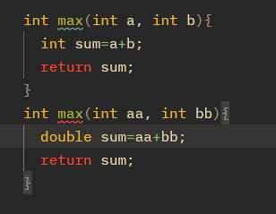

-----------x--------

When ‘int’ type variable is passed as argument “int overload will called”. Same as double and others.

----------------x--------------

lambda Function:

* Return type is not important. If keep blank, compiler is gonna deduce its type by itself.

* Use ‘;’ after function body. Because lambda function is a statement.

Here if lambda function return something, it going to assign to variable ‘fun’.

Capture lists on lambda function: Capture list is a part of lambda function inside the square brackets which tells the lambda function, which variable from the surrounding scope it can use and how(like using a copy of a variable or references).

* When a lambda function capture values, it made a copy of that variable on the memory. So if that variable is changed later it will not effect on that lambda function. Lambda function retain the old value unless we use variable as reference. See below…

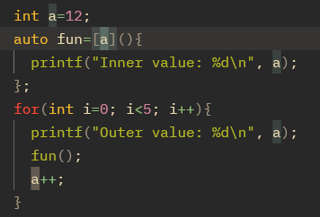

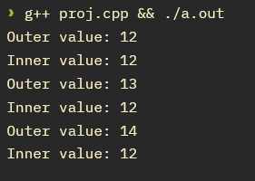

See when we use variable as reference:

If we print the addresses, we can clearly see that both(variable a, and lambda function variable a) variable have different addresses.

--------------

*** ”[=]” using this as capture list it will grab all variable from the surrounding scope. (To capture value)

*** ”[#]” using this as capture list it will grab all variable from the surrounding scope. (To capture as  references)

*** using reference, all have same addresses.

-------------x------------

Function Template:

Function Template by value: Function Template is a mechanism in c++ to set up a blueprint for functions, But compiler going generate the actual code when it sees the function called. Means to avoid code repetition.

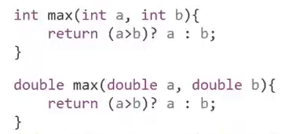

Here there are multiple function overload. They are doing the work. To minimise this type of multiple overload of same work. We can use Template.

“ T ” is a place holder for the data type function is going to receive as argument. But all argument data type have to be same(there is a room for not same data type). When compiler see, template function called. It going to look at the data type of arguments which are passing to function. Then compiler generate same function with that data type only when the function is called .

** can also pass string by argument.

Function templates are not c++ code. It just a function blueprint.

If data types are not same passing as argument, we can explicitly set the type with<double>. This basically tells the compiler to generate double/int etc. template instance function for this calling. And implicitly convert other type to determined type. In below example ”a” variable int type and will convert to double.

** We can see this internal conversion of function template on cppinsights.io.

This will give no error. Cause we explicitly tell to generate a double type template instance function. Otherwise, different type will not accept. Will throw an error.

If we use sizeof() to see size of the “re” variable. We can see is it double, int etc.

Template type parameter by references: Recall references procedure, template procedure. All same concept.

function overloaded. Cause calling

maximum(a,b); // this is used for both template with value and with reference. That’s why get confused.

---------------x-----------

Template Specialization: This is specially for “const char pointer” like: 

const char* x=”asdf”;

for const char pointer regular method will not work. There is a special template mechanism for it.

This does not compare like others in template. See 18:50 Hr

Instead it use c++ template library function “strcmp” to compare. See on www.cppreference.com about strcmp.

In order to use template specialization we have to declare primary template like below…

In order to use template specialization we have to declare primary template like below…

Whole code:

C++ 20:

Concept: Concept is a mechanism to set up constrain or restriction on template parameter of our function template. For example we can set that function to be called only integer and we call it something which isn’t ans integer, it will give a compiler error.

If we set double instead of int, this will compiler error. Cause we set “integral” type to accept as argument in function template.

These concepts are introduced in c++20. So use “-std=c++20” during compiling.

Concepts are introduced in c++20. Before that we can use this(below) inside function template. And set a custom message if condition does not meet.

Type Traits: Intro on C++11. A type trait is a small template “tool” that tells you something about a type, or transforms a type, at compile time. On above we are checking “T” is an integral or not by “is_integral<>”. Boolean value. Also Use this as requires. See below

We can use type traits on requires.

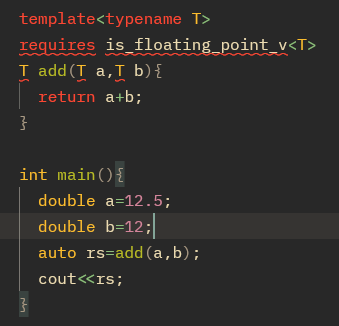

Some Type Traits:

Some ways to declare concepts:

Syntax 3 is only allowed for, when we use “auto”.(Below)

Example for Type Trait:

A type trait is a template utility in the C++ standard library (in <type_traits>) that allows you to query information about a type or transform a type at compile time.

Think of type traits as little “questions” or “tools” about types:

1. Is this type an integer?

2. Is this type const-qualified?

3. What happens if I remove a pointer from this type?

4. Are these two types the same?

Here the compiler removes the unused branch at compile time → no runtime cost.

Here without “constrxpr” if is checked at run time. So both branch(if, else) must compile because compiler doesn’t know which condition will be true.

But with “constexpr”

* if constexpr means the compiler chooses the branch at compile time.

* The unused branch is discarded before code generation — it’s as if it never existed. Means for (“print(42)”) compiler will keep only if part. And for (“print(3.14)”) compiler will keep else part.

*** Think f(42)=print(42) 

Generated machine code for print(42) contains no trace of the "not integral" branch.Generated machine code for print(3.14) contains no trace of the "integral" branch.

The compiler erases the irrelevant branch at compile time.

Constexpr- is a keyword in c++. That tells to evaluate the value in compile time.

See this from cppinsights.io comparing with and without “constexpr”

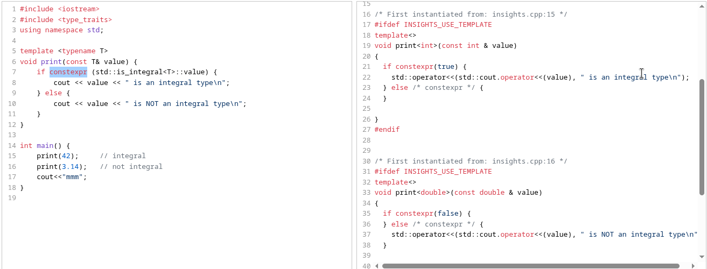

---------x----------

Build own Concept/Custom concept: 

Example 1:

Line- 9,10: Custom concept. Here we are setting function parameter have to integral type.

Line-13: function checks whether our parameter satisfy the concept. If one parameter is float it will give compiler error.

For int value the type trait (is_integral_v) is return true and concept is satisfied. And function template is gonna execute.

For double, float value we can use “is_floating_point<T>”.

Diff way to use concepts:

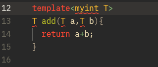

Example 2:

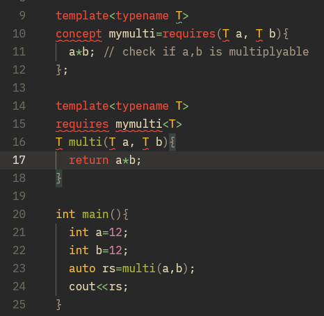

Line-10,11: requires 2 parameter which are multipliable. This will not give multiply of “a” ans “b” If pass (char) concepts will not satisfy. Error

Example 3: If we want “a” will be int and “b” will be double. See below. Use diff type name.

-------------x-----------

Deep dig into ‘Requires’ :

you can only put valid expressions involving the types/objects. requires doesn’t test boolean conditions — it just checks “is this expression well-formed?” check given expression is vakid or not.

Inside requires { ... }, each line is an expression requirement.

It only checks whether the expression is valid (well-formed) — not whether its value is true or false.

Here “sizeof(T)<=4” is simple requirement. Only check syntax.

Although b is double. It should give compiler error cause concepts does not meet(double size 8byte). It gives ans. Cause:

sizeof(T) <= 4 is always a valid expression (it produces a true value).

The compiler says “requirement satisfied” regardless of whether the condition is true or false.

It doesn’t enforce the size check.

This is correct way to set sizeof(). This will check conditions are true or false. And this will give error cause ‘b’ size is 8 byte. We set <=4.

Or we can use nested requirement(requires inside requires). See below(No error)

Example *: Using Logical operator...

Example **: 

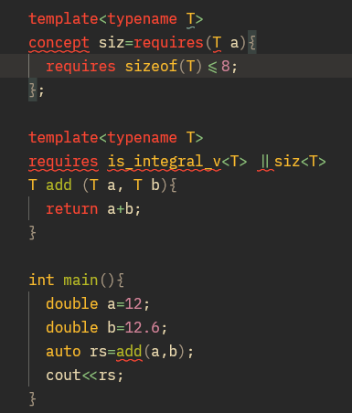

Exit(): “exit(1)” terminate the whole program. So if this is also used in used in a function, it stop the entire program.

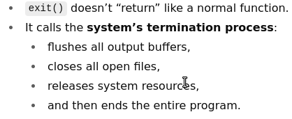

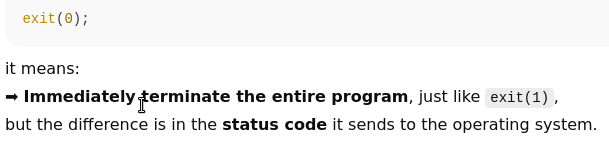

exit(0) → “Program ended successfully.”

exit(1) → “Program ended due to an error.” // abnormal termination of the program

------------x-----------

*** If we pass an array to a function it pass its reference through pointer. Not a copy.

OOP

Class: Class is a mechanism to build our own type to use them like we have been using built in type(int, double). Its like a blueprint to create object.

Object: An object is a real instance(copy) of that class. Like a actual car built from blueprint.

* Public means after “public” all parameter are accessible outside of the class.

* If public is not defined. Then in general all parameter are indicated to private. Means can’t access outside of the class. (Members of class are private by default).

* Public, private, protected are called access specifier.

* if public is not defined on above example. All member will be private. Line 19,20, 21 can’t write. Compiler will give error.

* Private members can be accessible from inside class.

* Objects(ob1) are run time data.

* Member variable should be set to private.

1. Constructor:

Constructor are 2 type.

1. Default constructor. //Method have no parameter line: 13

2. Parameterized constructor. //Have parameter Line: 17

* This is how private members can be accessible inside class.

* If an object is declare default constructor will be called. Line: 13

* if not defined(default constructor), compiler will automatically generate default empty constructor.

Or inside main

“mycls ob1(12,22);” parameterized constructor will be called. Line: 17. default will not be called.

* If compiler sees any constructor, its not gonna generate default constructor.

* We can declare default constructor 2 ways; on line:13 & 16

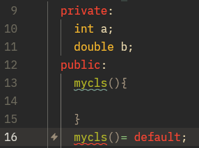

2. Setter & Getter:

Private members are not accessible from outside. Both are methods to modify or read member variable of a class.

----------x-----------

ifndef:

Means this constant is define on any other file of the project and we are not sure, we can use this. It says, if below code is not defined, I am defining here, else skip. Otherwise, if same things defined in many places, show error.

---------x------

“::” Scope Resolution Operator: Used when a function of a class us defined on other file.

Here “Cylinder” constructor is belong to Cylinder class. We can use any function instead constructor.

But we have to mention function prototype inside the class. Like: Cylinder(double red_…..);

--------x------

Manage class object by Pointer:

Here “ - >” is a dereferencing operator. Works like (*c2).findcir();

c2 pointer will be on stack memory but obj will be on heap.

Direct creating object creates on stack and with using pointer object will create on heap. Remember to release memory.

dangling pointer is dangerous. Holds old memory. So after deleting set c2=nullptr;

3. Destructors:

Destructors are called by the compiler to destroy our objects.

When Destructor Called?

* When local stack objects goes out of scape then destructor is going to be called by compiler.

* When heap object is released with delete.

*** Destructor has no parameter.

*** Destructor does not called by compiler automatically for heap data. We have to release memory like line 32(below)

*** The compiler calls destructor for objects with automatic storage duration when they leave scope.

If I have 3 objects(d1,d2,d3), destructor will call 3 times. But in reverse order. ‘d3’ destructor will call 1st and d1 destructor in last.

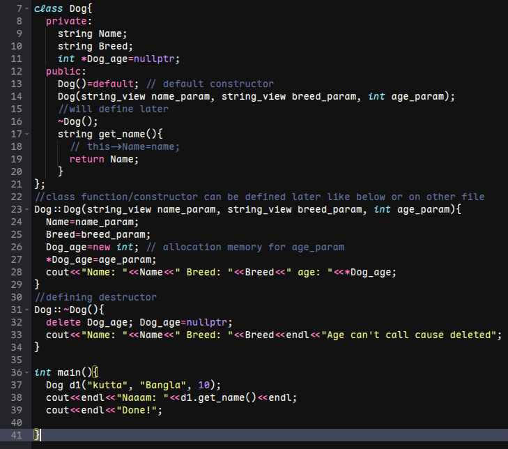

Explained Below:

* “d1” is a local object. It destroyed when main() exits its scope after line 39 and before the program returns from main(line 41);

* ”d1” lives in stack. When main ends, C++ compiler automatically calls destructor. Memory released for ‘d1’ object.

In line 23 string_view

Diff Bet string_view & string:

Pass an object by value: see 22:00:00 hr

4. “this” Pointer: ‘this’ is a special kind of pointer, maintain by c++ to manipulate the current object. This ‘this’ pointer contains the address of the current object.

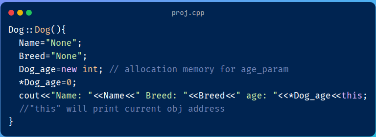

//"this" will print current object address

Not exactly pointing to the current object member(above).

Chained call using Pointer:

Chained call using Reference:

Here ‘const’ is important to include.

What happen in line: 33

5. Struct Vs Classes: Struct is another way to define classes. Differences:

So We can use struct when we have public members. But both are almost same. We can use anyone.

6. Size of the class objects: Size of the class objects depends on the member of the class, not functions.

Here, string size is 32 byte whether I put no character or put millions of character. It will remain same. We are not getting memory which occupy by characters, but getting the fixed size of the string object itself in the memory. It includes internal pointers, metadata(like length, capacity) and other housekeeping data.

If I put millions of characters inside string, it will store in separate dynamically allocated memory in the heap. 

Above is in general. But for small string, there may be diff scenario: below

Object size:

Here object size should be 44 byte. But Actual size is 48. cause, Alignment rule

The total object size must be a multiple of the largest alignment (here: 8 bytes)

so there will 4 byte padding after 4 byte integer memory. See memory layout: below

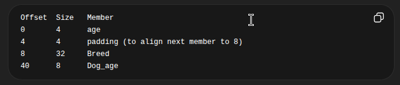

Here Offset is the byte position of a member inside an object, measured from the object start.

For functions:

Inheritance

1. Inheritance: Inheritance in C++ is a mechanism that allows a new class (derived class) to inherit properties and behaviours (methods) from an existing class (base class), promoting code reuse and creating a hierarchical relationship between classes.

When a class inherits another class, it gets all the accessible members of the parent class, and the child class can also redefine (override) or add new functionality to them.

Public, private, protected are access specifier.

in the above example, player class inherits all public members of human. But can’t access private. That’s why we only can print ‘age’ variable. Also passing string through player object(”motaher”, “emon”) constructor will be unused. We have to use public setter & getter.

***Protected member: Sometime we may want that members of base class has to be accessible from derived class but still be inaccessible from outside. In that case use those member as protected member. Below:

***Base class access specifier:

Here” Public” is base class access specifier. This is public inheritance. This can be private/protected.

This tell how accessible the base class members to derived class.

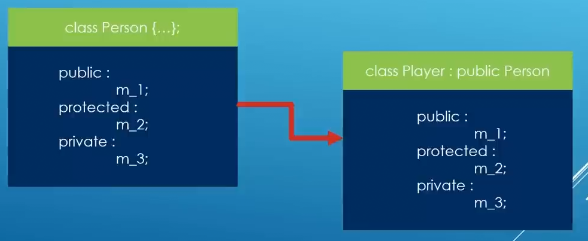

Public Inheritance:

1. Anything public in base class, will remain public in derived class.

2. Anything protected in base class, will remain protected in derived class.

3. Private members are never inherited. Derived class can’t access.

Others(private, protected) we can derived from our assumption.

Here, Engineer class is inherited by CivilEngr class. And Person class is inherited by Engineer class privately. So CivilEngr class can’t access any member from person class. Cause all members(except m_3) from base class(person) is private to Engineer class. Engineer class can access. But can’t CivilEngr..

But But But

C++ allow us do something else so we can access from civilEng class.

we can use m_1, m_2 member in CivilClass by using “using” keyword. See below:

Here ‘using’ does is Bring member ‘pMotherName’ from class A into current class scope. It re-expose the member.

Though “pMotherName” member is protected. We can use in myFamily class, explained below:

-----------x----------

2. Default Arc Constructor with inheritance:

Always provide default constructor for classes. Because compiler may calls these default constructor, specially if the class of inheritance.

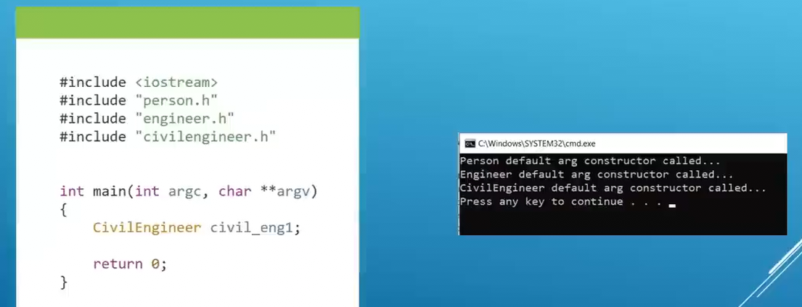

If we build a civilengr object and we don’t have a default constructor for person class, compiler is going to call that, but will not find and give error.

Compiler will go for base class first then the other layer which was inherited to call all the constructor.

--------x------

3. Initializer List: Give a variable/object its first valid value at the moment it is created.

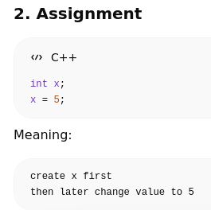

Explain: Initializer List vs Assignment

4. Custom constructor with Inheritance: Some time we need to call custom constructor to be called instead of default with many parameter.

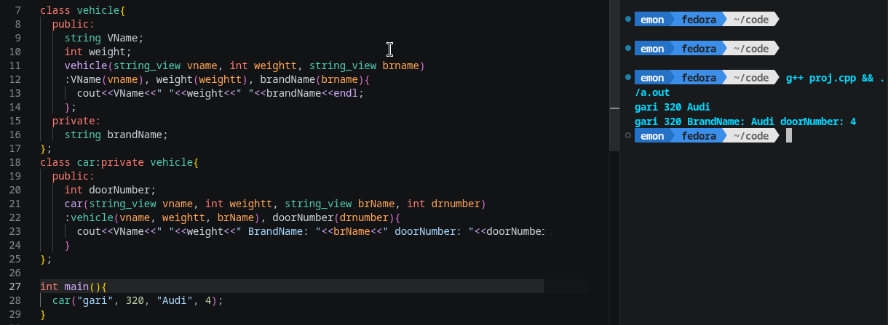

The car class constructor uses an initializer list to initialize both the base class and its own members.

Initializer List: :vehicle(vname, weight, brName), doorNumber(drnumber)

:vehicle(...) - Calls the base class vehicle constructor, passing the name, weight, and brand name to initialize inherited members

doorNumber(drnumber) - Initializes the doorNumber member variable with the provided value 

-----------x--------

5. Copy Constructors with Inheritance: A copy constructor in C++ is a member function that initializes a new object using an existing object of the same class. It is the standard mechanism for duplicating object data and takes a reference to the source object as its parameter.

Here a new object initialize using existing object(manus).

Here, in Line 20: copy constructor of human class is receiving an object reference and initialize the member value from the source.

~~~

human(source);//line 34

~~~

this means: copy the human portion from the source using human copy constructor(line 34)

~~~

human(const human& source); //line 20 or 34 same

~~~

This Means: Take a human object by reference.

Flow chart for above code:

→ player “manus” object is created.

→ player copy constructor called for “manus1” and passing “manus” object as as constant reference

→ human(source) executed

→ human copy constructor received a object reference of “manus” and copy its part and initialize “manus1” members of human class.

→ Back to the player copy constructor. And copy and initialize player class member for “manus1”.

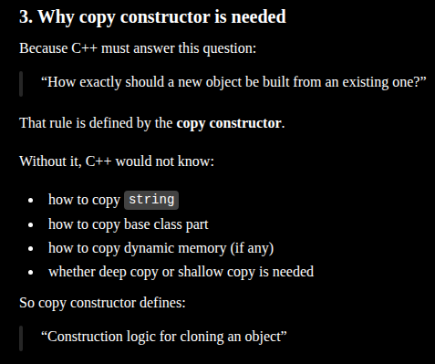

When we need:

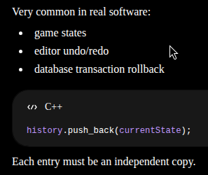

## Core rule (very important)

“Copy constructor is NOT for normal use — it is for creating a new independent object with same state when the program explicitly needs duplication.”

6. Inheriting Base Constructor: 
