# 📘 C++ Hand Notes — FreeCodeCamp 31-Hour Video

> **Source:** [C++ Programming Course – Beginner to Beyond (31 Hours)](https://www.youtube.com/watch?v=8jLOx1hD3_o) by FreeCodeCamp  
> **Reference:** [cppreference.com](https://en.cppreference.com) · [cplusplus.com](https://www.cplusplus.com)

---

## 🌟 Key Features of C++

C++ supports **data abstraction** — hiding implementation details of data types and exposing only the essential behaviour to the outside world. This facilitates design, implementation, and maintenance of complex software systems through clear interfaces, encapsulation, modularity, and information hiding.

---

## 📑 Table of Contents

- [Basics](#basics)
  - [Statement](#statement)
  - [Variable](#variable)
  - [Number System & Data Types](#number-system--data-types)
  - [Float and Double](#float-and-double)
  - [Boolean](#boolean)
  - [Character](#character)
  - [Operators](#operators)
  - [Manipulators](#manipulators)
  - [Math Library](#math-library)
  - [Type Conversion](#type-conversion)
  - [Flow Control](#flow-control)
  - [Arrays](#arrays)
  - [Enum](#enum)
- [Pointers & Memory](#pointers--memory)
  - [Pointer](#pointer)
  - [Memory Map](#memory-map)
  - [Dynamic Memory Allocation](#dynamic-memory-allocation)
  - [Dangling Pointer](#dangling-pointer)
  - [NULL Pointer Safety](#null-pointer-safety)
  - [Memory Leaks](#memory-leaks)
  - [Dynamic Arrays](#dynamic-arrays)
  - [Reference](#reference)
- [Functions](#functions)
  - [String & Character Array](#string--character-array)
  - [Swap Two Numbers](#swap-two-numbers)
  - [Returning Reference from Function](#returning-reference-from-function)
  - [Function Overloading](#function-overloading)
  - [Lambda Function](#lambda-function)
  - [Function Template](#function-template)
  - [Template Specialization](#template-specialization)
- [C++20 Features](#c20-features)
  - [Concepts](#concepts)
  - [Type Traits](#type-traits)
  - [Custom Concepts](#custom-concepts)
  - [Deep Dive into Requires](#deep-dive-into-requires)
- [OOP — Object-Oriented Programming](#oop--object-oriented-programming)
  - [Class & Object](#class--object)
  - [Constructor](#constructor)
  - [Setter & Getter](#setter--getter)
  - [ifndef & Scope Resolution Operator](#ifndef--scope-resolution-operator)
  - [Managing Class Objects by Pointer](#managing-class-objects-by-pointer)
  - [Destructor](#destructor)
  - [this Pointer](#this-pointer)
  - [Struct vs Class](#struct-vs-class)
  - [Size of Class Objects](#size-of-class-objects)
- [Inheritance](#inheritance)
  - [Inheritance Basics](#inheritance-basics)
  - [Access Specifiers & Protected Members](#access-specifiers--protected-members)
  - [Base Class Access Specifier](#base-class-access-specifier)
  - [Default Arc Constructor with Inheritance](#default-arc-constructor-with-inheritance)
  - [Initializer List](#initializer-list)
  - [Custom Constructor with Inheritance](#custom-constructor-with-inheritance)
  - [Copy Constructors with Inheritance](#copy-constructors-with-inheritance)
  - [Inheriting Base Constructor](#inheriting-base-constructor)

---

## Basics

### Statement

A **statement** is a basic unit of computation in a C++ program. It ends with a semicolon `;` and statements are executed from top to bottom when the program runs.

---

### Variable

A **variable** is a piece of memory used to store a specific type of data.

---

### Number System & Data Types

> `***` Modifiers like `signed`, `unsigned` are used with integral data types (whole numbers). Cannot be used with `float`, `double`.

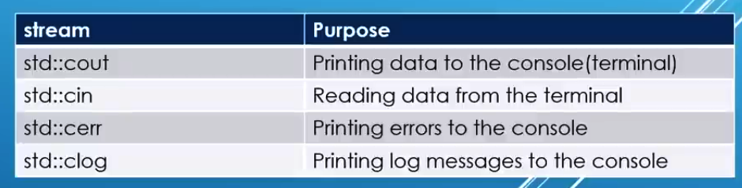


---

### Float and Double

> `**` Precision includes digits **before** the decimal point. For example: `12547.325` → `12547` is included in the precision count.

- **Float** (precision ~7 digits): `12345.6789` → `89` will be garbage. May print as `12345.6725`
- `float a = 123456789` → `89` will be garbage. May print as `12345.6745`

Floating point memory representation is not similar to decimal numbers — explained in [IEEE 754](https://www.youtube.com/watch?v=8afbTaA-gOQ&t=181s).

```cpp
cout << setprecision(20);
```

- Default precision (without setting): **6 digits total** (not after decimal point)
- With `fixed` + `setprecision(4)`: precision is 4 **after** decimal point → `a = 12.1234`
- Without `fixed` + `setprecision(4)`: precision is 4 **total digits** → `a = 12.12`

> Library needed: `#include <iomanip>`

**Suffixes:**
```
u   // unsigned
ul  // unsigned long
ll  // long long
```


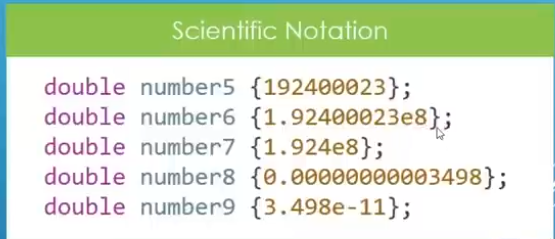

---

### Boolean

> `**` Booleans occupy **1 byte / 8 bits** in memory.

```cpp
bool x = true;   // or bool x = 1;
bool y = false;  // or bool y = 0;

cout << boolalpha;  // prints true/false instead of 0/1
cout << x << " " << y;
// Output: true false
```

---

### Character


> `**` `31 / 10` means how many times 10 fits in 31 → answer is **3**.

---

### Operators

- **Relation Operators:** `>`, `<`, `>=`, `<=`
- **Logical Operators:** `&&`, `||`, `!`

---

### Manipulators

📎 Reference: [https://en.cppreference.com/w/cpp/io/manip](https://en.cppreference.com/w/cpp/io/manip)

- **`std::flush`:** Normally, output goes to a "buffer" first; only when buffer is full does it go to the terminal. `std::flush` sends data directly to the console without waiting.
- **`setw()`:** Sets the width of the next output.
- **`cout << right;`** — right-align output; `cout << left;` — left-align.
- **`cout << setfill('-')`** — fill blank spaces with `'-'`.

**Finding numeric limits:**
```cpp
#include <limits>
```
📎 [https://en.cppreference.com/w/cpp/types/numeric_limits](https://en.cppreference.com/w/cpp/types/numeric_limits)


---

### Math Library

```cpp
#include <cmath>
// abs(), pow(), ceil(), log(), sqrt(), sin(), tan() ...
```
📎 [https://en.cppreference.com/w/cpp/header/cmath](https://en.cppreference.com/w/cpp/header/cmath)

> `log(10)` means **logₑ(10)**. To fix base: use `log10(10)`. E ≈ 2.71

- `round()`: `3.5` → `4`, `3.49` → `3`

---

### Type Conversion

If a data type **less than 4 bytes** is used in an arithmetic operation, the compiler automatically converts it to 4 bytes. This behavior also applies to bitwise operators (`>>`, `<<`).

---

### Flow Control

**`if-else`, `switch`, ternary operator**

- **Switch:** If `break` is not used, all cases after the matching one will execute (fall-through).
- Switch can use `int`, `char`, `double`, `enum` etc. as case values — but **not** `string`.

---

### Arrays

- Using `const` before array declaration prevents modification of elements.
- `a[] = {2,3,7,5,2,3};` — `size(a)` or `sizeof(a)/sizeof(a[0])` returns the array size.


---

### Enum

An **enum** is a special type that represents a group of constants (unchangeable values).

```cpp
enum Level { LOW, MEDIUM, HIGH };
Level myVar = MEDIUM;
cout << myVar; // Output: 1
```

- Default: first item = `0`, second = `1`, etc.
- You can assign custom values; subsequent items update accordingly.

#### Why And When To Use Enums?

Enums give names to constants, making code easier to read and maintain. Use when values won't change — e.g. month days, days of week, colours, card suits, etc.


---

## Pointers & Memory

### Pointer

A **pointer** is a special kind of variable that stores a memory address.

```cpp
int* int_num{};       // initialized with nullptr (not pointing anywhere)
int* int_num{nullptr}; // explicitly nullptr

double* frac_num{};   // will point to a double type variable
```

> `**` Pointers of `int`, `double`, `char` etc. are **all the same size** — they only store addresses.

```cpp
char *ptr{"Hello world"}; // Points to 1st character
// Some compilers (MSVC) won't compile this; GCC gives a warning.

cout << ptr;   // Prints whole string
cout << *ptr;  // Prints 1st character 'H'
*ptr = 'B';    // May give error — compiler treats it as const char array
```

To modify: use array instead:
```cpp
char msg[10] = "Hello world";
// OR
const char *ptr{"Hello world"}; // no warning, can't modify
```

**Dereferencing:** reading the value at the pointer's address → `cout << *ptr;`

**String with pointer:**
```cpp
const char* p_msg = "Hello World!"; // correct
// printf p_msg → prints whole string
// *p_msg → prints first character
```

> `***` Without `const`, compiler warns/refuses because the string becomes a constant char array, but the pointer type doesn't guarantee immutability.

```cpp
int *ptr;      // contains junk address — DANGEROUS
int a = 12;
int *ptr = &a; // CORRECT — always initialize
```


---

### Memory Map

When a program runs, it runs on RAM. Each process thinks it owns `0 ~ 2ᴺ` amount of memory — this is **virtual memory**.

The program goes through a CPU section called **MMU (Memory Management Unit)** which maps the program's virtual memory to actual RAM.

> Parts likely not to be used are discarded from RAM. MMU transforms between the virtual idea and real RAM.

> The memory map/structure is a standard format defined by the OS. That's why Windows programs can't run directly on Linux.

**Memory Sections:**

| Section | Purpose |
|---------|---------|
| **STACK** | Local variables, print statements, function calls |
| **TEXT** | Actual binary code loaded for CPU execution |
| **HEAP** | Additional memory for runtime use; dynamic allocation |


---

### Dynamic Memory Allocation

- Variables declared in stack are removed when their scope ends — the developer has no control.
- With **heap**, the developer has full control over when a variable comes into existence and when it dies.

```cpp
int* p_number4 = new int; // OS allocates memory on heap

delete p_number4;         // Return memory to OS
p_number4 = nullptr;      // Reset pointer — good practice
```

> `*` `delete` removes allocated heap memory (what pointer points to). It does **not** remove the pointer itself. Deleting `nullptr` does nothing.

> `***` **Always remember to release memory.**


**'New' fails:**

When allocating huge sizes, `new` may fail and crash the program. Use exception mechanism or `nothrow`:

```cpp
// Exception mechanism:
try {
    int* p = new int[1000000000000];
} catch (std::bad_alloc& e) {
    cout << e.what(); // Program keeps running
}

// nothrow:
int* p = new(nothrow) int[1000000000000];
if (!p) { /* handle nullptr */ }
```

📎 [Anisul Islam — Exception Handling](https://www.youtube.com/watch?v=uoCuMTzD9AE&list=PLgH5QX0i9K3q0ZKeXtF--CZ0PdH1sSbYL&index=90)


---

### Dangling Pointer

A **dangling pointer** doesn't point to a valid memory address. Dereferencing it causes **undefined behaviour**.

**How dangling pointers are created:**
1. Uninitialized pointer
2. Deleted pointer
3. Multiple pointers pointing to the same memory

**Solutions:**
1. Always initialize pointer — either with a valid address or `nullptr`
2. Reset pointer after `delete` (valid address or `nullptr`)
3. For multiple pointers to same address — make sure the master pointer is cleared/reset

> `***` Always check `if (ptr != nullptr)` before using a pointer.


---

### NULL Pointer Safety

```cpp
if (ptr != nullptr) { /* safe to use */ }
// OR: pointer address implicitly converts to boolean (null == 0)
if (ptr) { /* safe */ }
```

> After using `delete`, always set pointer to `nullptr` for safety.


---

### Memory Leaks

If a pointer changes its pointing location to a second allocation without deleting the first, the first memory block becomes unreachable → **memory leak**.

```cpp
// WRONG:
int* p = new int(55);
p = new int(99); // lost access to 55 — memory leak!

// CORRECT:
delete p;
p = new int(99);
```

After a local scope ends, the pointer dies but heap-allocated memory remains — another source of memory leaks. These can cause program crashes.


---

### Dynamic Arrays

Arrays stored on the **heap**.

```cpp
int* arr = new int[size]; // size determined at runtime
// ...
delete[] arr; // release array memory
arr = nullptr;
```

Dynamic arrays are created at **run time**, not compile time.


---

### Reference

A **reference** is an alias (another name) for an existing variable. It does not create a new variable or occupy memory — it just provides another way to access the same memory. Unlike pointers, it does not hold addresses.

```cpp
int s = 5;
int& ref = s; // ref is an alias for s
```

- Changing `ref` or `s` both affect the same memory.
- `&ref` and `&s` have the **same memory address**.
- A pointer can be reassigned to another variable — a **reference cannot**.


Here `S` and `ref` both change to `12`.

**Use case:** Modifying the original variable inside a function (saves memory).


**Returning reference from a function to a local or global variable:**


**`const` reference:**

```cpp
const int& ref = s;
// Can't change s through ref, but s itself can still change its value.
```


---

## Functions

### String & Character Array

> `***`
> - `size()` / `sizeof()` return size. For **character arrays**, this **includes** the null terminator `\0`. For `string`, `size()` does **not** count null.
> - `strlen()` is for character arrays, not `string`.

```cpp
char *a = "asdf";   // string literal — NOT modifiable (read-only memory)
char a[] = "asdf";  // character array — modifiable (stack memory)
```

Use `const` for string literals:
```cpp
const char *msg = "Hello I am here.";
```

> `***` A string literal is actually a character array. When assigned to `const char*`, it automatically converts to a pointer to its first element. `string` internally uses `const char*` and stores data in separately allocated heap memory.

Character arrays live in **read-only memory** — cannot be modified.

---

### Swap Two Numbers

```cpp
// Method 1 (arithmetic):
a = a + b;  b = a - b;  a = a - b;

// Method 2 (XOR):
a = a ^ b;  b = a ^ b;  a = a ^ b;
```

---

### Returning Reference from Function

Usually functions return values. But sometimes the compiler returns a reference instead to avoid copies.

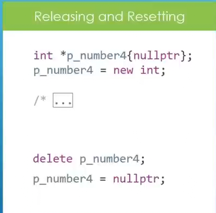

Both addresses shown are the same — it returns a reference using the reference mechanism.

---

### Function Overloading

**Function overloading** allows multiple functions with the same name in the same scope, but with different parameter lists (different parameter types: `int`, `double`, `float`, etc.).


When an `int` variable is passed as argument, the `int` overload is called. Same for `double` and others.

---

### Lambda Function

```cpp
auto fun = [](int a, int b) /* return type optional */ {
    return a + b;
};  // note the semicolon — lambda is a statement
```

- Return type is optional; the compiler deduces it automatically.
- Use `;` after the function body.


If lambda returns something, it is assigned to the variable `fun`.

**Capture lists:**

The capture list (inside `[]`) tells the lambda which variables from the surrounding scope it can use and how.

- By default, captured values are **copies** — changes to the original variable after capture won't affect the lambda.
- Use `&` to capture by **reference**.

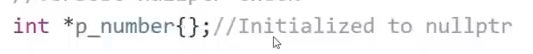


Addresses of value-captured and reference-captured variables differ (value) or are the same (reference).

```cpp
[=]  // capture all variables by value
[&]  // capture all variables by reference
```

> `***` Using reference, all variables share the same address.

---

### Function Template

**Function Template** is a mechanism to create a blueprint for functions. The actual code is generated by the compiler when the function is called — avoids code repetition.

```cpp
template <typename T>
T maximum(T a, T b) {
    return (a > b) ? a : b;
}
```

`T` is a placeholder for the data type. The compiler generates a typed version of the function at the call site.

> `**` Can also pass `string` as argument.

> Function templates are **blueprints**, not actual C++ code.

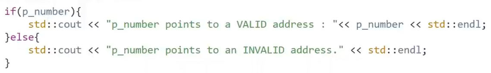

**Explicit type specification:**

```cpp
maximum<double>(a, b); // forces double template instance; implicitly converts other types
```


> Use [cppinsights.io](https://cppinsights.io) to inspect internal template instantiation.

**Template by reference:**

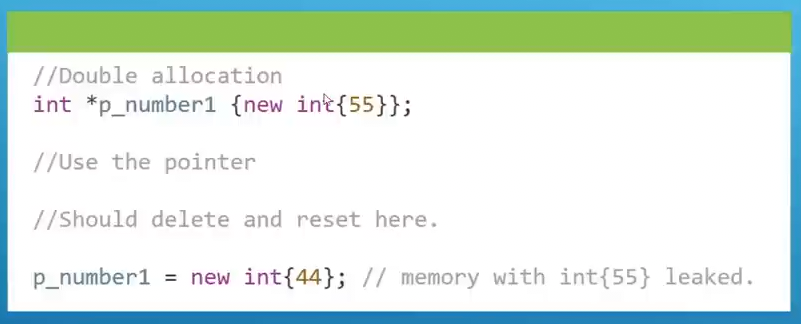

> If you call `maximum(a, b)` where both a template-by-value and a template-by-reference exist, the compiler gets confused. Disambiguation is needed.

---

### Template Specialization

Used specially for `const char*` pointers:

```cpp
const char* x = "asdf";
```

For `const char*`, regular templates don't work. Use `strcmp` (from `<cstring>`) for comparison. A primary template declaration is required first.

📎 See [cppreference.com — strcmp](https://en.cppreference.com/w/cpp/string/byte/strcmp)


---

## C++20 Features

### Concepts

A **concept** is a mechanism to set constraints/restrictions on template parameters.

```cpp
#include <concepts>

template <std::integral T>
T add(T a, T b) { return a + b; }

add(1, 2);     // OK
add(1.0, 2.0); // Compiler error — not integral
```

> Compile with `-std=c++20`


**Before C++20 (C++11 `static_assert`):**

```cpp
template <typename T>
T add(T a, T b) {
    static_assert(std::is_integral<T>::value, "T must be integral!");
    return a + b;
}
```


---

### Type Traits

Introduced in **C++11**. A **type trait** is a small template "tool" that tells you something about a type, or transforms a type, at compile time.

```cpp
#include <type_traits>
std::is_integral<T>::value  // is T an integer?
std::is_const<T>::value     // is T const-qualified?
std::is_same<T, U>::value   // are T and U the same type?
```

**Think of type traits as compile-time questions:**
1. Is this type an integer?
2. Is this type const-qualified?
3. What happens if I remove a pointer from this type?
4. Are these two types the same?

**`if constexpr` (C++17):**

```cpp
template <typename T>
void print(T val) {
    if constexpr (std::is_integral_v<T>) {
        cout << "Integer: " << val;
    } else {
        cout << "Not integer: " << val;
    }
}
```

- `if constexpr` chooses the branch at **compile time**.
- The unused branch is **discarded before code generation** — zero runtime cost.
- Without `constexpr`: both branches must compile (runtime check).
- With `constexpr`: irrelevant branch is erased by the compiler.

> `constexpr` is a keyword telling the compiler to evaluate the value at compile time.

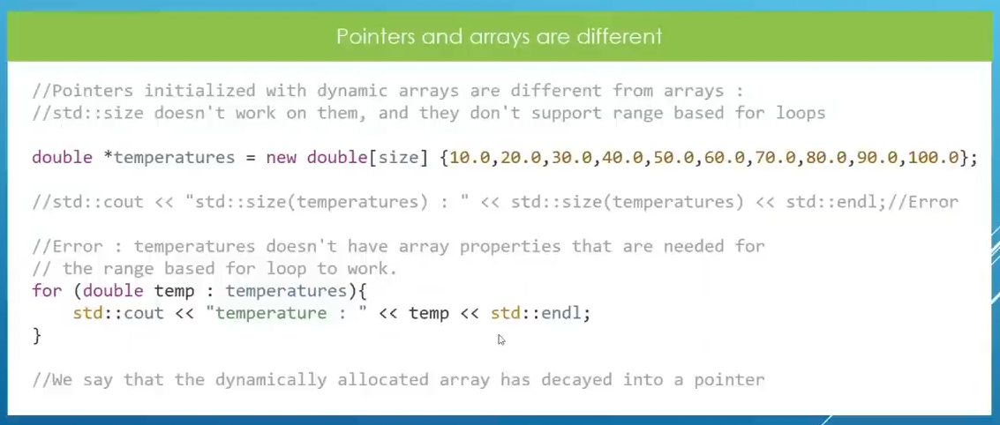


**Some type traits:**


---

### Custom Concepts

**Ways to declare concepts:**


> Syntax 3 is only allowed when using `auto`.

**Example 1 — Integral constraint:**

```cpp
template <typename T>
concept Integral = std::is_integral_v<T>;  // line 9,10

template <Integral T>                       // line 13
T add(T a, T b) { return a + b; }
```

- For `int`: `is_integral_v<T>` is `true` → concept satisfied.
- For `float`/`double`: compiler error.

For floating point: use `std::is_floating_point<T>`.


**Different ways to use concepts:**


**Example 2 — Requires multipliable:**

```cpp
// Requires 2 parameters that are multipliable
// If char is passed, concept won't be satisfied → error
```

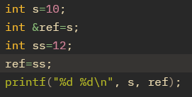

**Example 3 — Different types for parameters:**

```cpp
// 'a' must be int, 'b' must be double — use different type names
```


---

### Deep Dive into Requires

`requires { ... }` tests only **if an expression is well-formed** (valid syntax), not whether its value is true or false.

```cpp
requires { sizeof(T) <= 4; }  // Only checks syntax — always passes!
```

> Even if `T` is `double` (8 bytes), this passes because `sizeof(T) <= 4` is syntactically valid.

**Correct way to check size constraint:**

```cpp
requires { requires sizeof(T) <= 4; }  // Nested requires — checks condition is true
```


**Logical operators in requires:**


**`exit()` function:**

```cpp
exit(0); // Program ended successfully
exit(1); // Program ended due to an error (abnormal termination)
```

> `exit(1)` terminates the **entire program**, even if called inside a function.

---

## OOP — Object-Oriented Programming

### Class & Object

- **Class:** A mechanism to build custom types, like a blueprint to create objects.
- **Object:** A real instance (copy) of that class. Like an actual car built from a blueprint.

**Access specifiers:** `public`, `private`, `protected`

- `public`: members accessible from outside the class.
- `private` (default if not specified): accessible only from inside the class.
- Member variables should generally be **private**.
- Objects are **runtime data**.

```cpp
class MyCls {
private:
    int x, y;
public:
    // accessible from outside
};
```


> If no access specifier is defined, all members are **private** by default.

---

### Constructor

**Types of Constructors:**

1. **Default constructor** — no parameter
2. **Parameterized constructor** — has parameters

```cpp
MyCls ob1;        // calls default constructor
MyCls ob1(12,22); // calls parameterized constructor
```

- If no constructor is defined, the compiler generates an empty default constructor.
- If **any** constructor is defined, the compiler does **not** generate a default one.
- Default constructor can be declared two ways.


---

### Setter & Getter

Private members are not accessible from outside. Setters and getters are methods to modify or read member variables of a class.


---

### ifndef & Scope Resolution Operator

**`#ifndef`:** "If Not Defined" — used to prevent multiple definitions of the same thing across files.

```cpp
#ifndef MY_HEADER_H
#define MY_HEADER_H
// code
#endif
```

**`::` Scope Resolution Operator:** Used when a function of a class is defined in another file.

```cpp
Cylinder::Cylinder(double rad, double h) { ... }
// Function prototype must be declared inside the class
```


---

### Managing Class Objects by Pointer

```cpp
Cylinder* c2 = new Cylinder(3.5, 4.0);
c2->findCircumference(); // dereferences and calls method
// equivalent to: (*c2).findCircumference();
```

- `c2` pointer lives on **stack**; the object lives on **heap**.
- Direct object creation → **stack**. Pointer-based → **heap**.
- Remember to release: `delete c2; c2 = nullptr;`


> Dangling pointer is dangerous. After `delete`, always reset to `nullptr`.

---

### Destructor

**Destructors** are called by the compiler to destroy objects.

**When is a destructor called?**
- When a local stack object goes out of scope.
- When a heap object is released with `delete`.

> `***` Destructor has **no parameters**.

> `***` Compiler does **not** call destructor automatically for heap data — you must use `delete`.

> `***` Compiler calls destructors for objects with automatic storage duration when they leave scope.

If 3 objects (`d1`, `d2`, `d3`) exist, destructors are called **in reverse order** (`d3` first, `d1` last).

```cpp
// d1 is a local object → destructor called when main() exits its scope
// d1 lives in stack → C++ compiler calls destructor automatically
```


**`string_view` vs `string`:**


---

### this Pointer

`this` is a special pointer maintained by C++ to manipulate the **current object**. It contains the address of the current object.

```cpp
cout << this; // prints current object address
```


**Chained call using Pointer:**


**Chained call using Reference:**

```cpp
// 'const' is important to include here
```


---

### Struct vs Class

`struct` is another way to define classes.

**Key difference:**

| Feature | `struct` | `class` |
|--------|---------|--------|
| Default access | `public` | `private` |


> Both are almost the same in C++. Use `struct` when you have predominantly public members.

---

### Size of Class Objects

The size of a class object depends on its **member variables**, not on functions.

```cpp
string s = ""; // size is 32 bytes regardless of content
```

The `string` object itself has a fixed size (internal pointers, metadata: length, capacity, etc.). Actual character data for large strings is stored in separate heap memory.

**Alignment rule:**

```cpp
// Object should be 44 bytes, but actual size is 48 bytes
// Reason: total object size must be a multiple of the largest alignment (here: 8 bytes)
// 4-byte padding is added after the 4-byte int member
```


> **Offset:** the byte position of a member inside an object, measured from the object start.

**For functions:**


---

## Inheritance

### Inheritance Basics

**Inheritance** allows a derived class to inherit properties and behaviours from a base class, promoting code reuse and creating a hierarchical relationship.

```cpp
class Player : public Human {
    // Player inherits all public members of Human
};
```

When a class inherits another, it gets all **accessible** members of the parent class, and can override or add new functionality.


---

### Access Specifiers & Protected Members


In the example: `player` class inherits all public members of `human`, but cannot access private ones. Only `age` can be printed; passing strings via the `player` constructor is unused without setters/getters.

**Protected members:** accessible from the derived class but **inaccessible** from outside.


---

### Base Class Access Specifier

```cpp
class Player : public Human  // 'public' is the base class access specifier
```

This determines how accessible base class members are to the derived class.

**Public Inheritance:**
1. `public` in base → remains `public` in derived
2. `protected` in base → remains `protected` in derived
3. `private` members are **never inherited** — derived class cannot access


**Multi-level Example:**

Here `Engineer` is derived from `Person` privately. `CivilEngr` inherits from `Engineer`. So `CivilEngr` cannot access `Person`'s members (they're private to `Engineer`).

But C++ allows re-exposing with `using`:

```cpp
class CivilEngr : public Engineer {
public:
    using Engineer::m_1; // re-exposes m_1
    using Engineer::m_2;
};
```

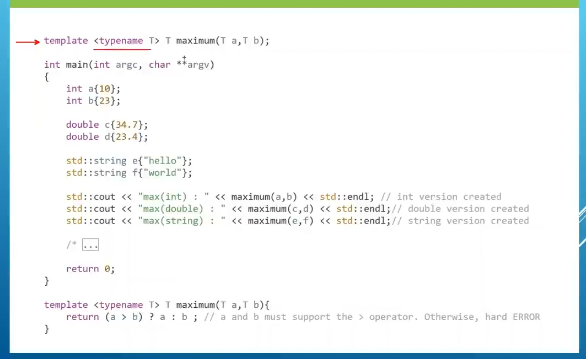

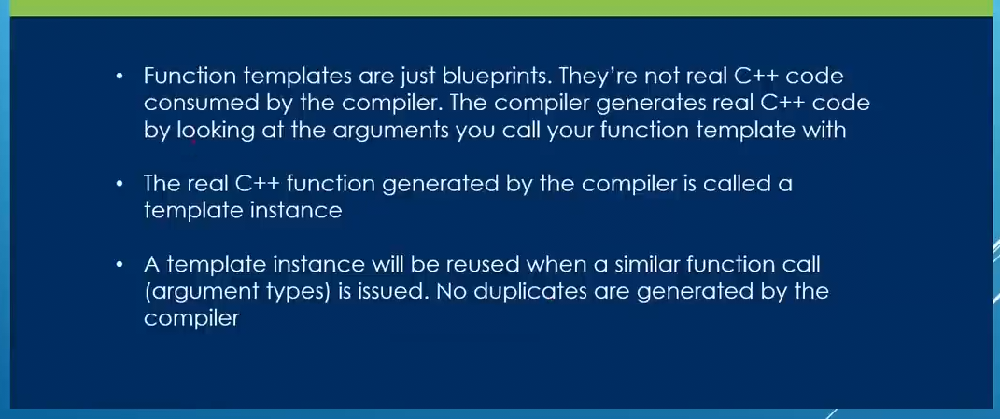

`using` brings the member into the current class scope — **re-exposes** it.


---

### Default Arc Constructor with Inheritance

Always provide a **default constructor** for classes used in inheritance hierarchies. The compiler will call all default constructors up the chain.

```cpp
// If Person class has no default constructor and CivilEngr is built → compiler error
```

> Compiler goes to the base class first, then each layer up the hierarchy, calling all constructors.


---

### Initializer List

An initializer list gives a variable/object its **first valid value at the moment it is created**.

```cpp
MyClass(int x) : member(x) { }
```

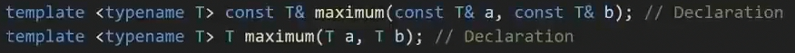


**Initializer List vs Assignment:**


---

### Custom Constructor with Inheritance

Sometimes a custom (parameterized) constructor needs to be called instead of the default.

```cpp
Car(string vname, double weight, string brName, int drnumber)
    : Vehicle(vname, weight, brName), doorNumber(drnumber) { }
```

- `:Vehicle(...)` — calls the base class `Vehicle` constructor to initialize inherited members.
- `doorNumber(drnumber)` — initializes `Car`'s own member.


---

### Copy Constructors with Inheritance

A **copy constructor** initializes a new object using an existing object of the same class. It takes a `const` reference to the source object.

```cpp
human manus1(manus); // new object initialized from existing object
```

```cpp
human(const human& source); // copy constructor declaration
```

**Flow for the code:**
1. `player "manus"` object is created.
2. Player copy constructor called for `"manus1"`, passing `"manus"` as const reference.
3. `human(source)` is executed.
4. Human copy constructor receives `"manus"` reference, copies its members to initialize `"manus1"`'s human portion.
5. Back to player copy constructor — copies player-specific members for `"manus1"`.


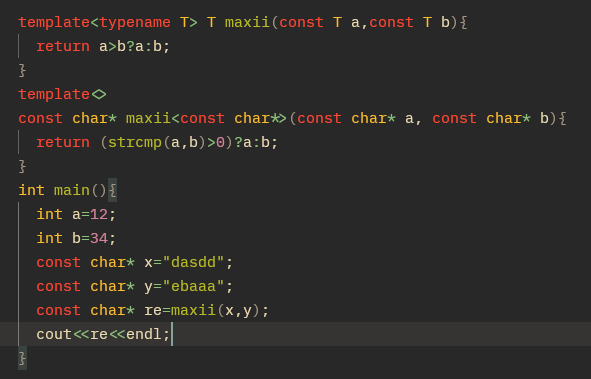

**When do we need a copy constructor?**


---

> ### 🔑 Core Rule (very important)
>
> **"Copy constructor is NOT for normal use — it is for creating a new independent object with the same state when the program explicitly needs duplication."**

---

### Inheriting Base Constructor

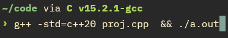

---

## 📚 Resources

| Resource | Link |
|----------|------|
| FreeCodeCamp C++ Full Course | [YouTube](https://www.youtube.com/watch?v=8jLOx1hD3_o) |
| cppreference.com | [cppreference.com](https://en.cppreference.com) |
| IEEE 754 Explained | [YouTube](https://www.youtube.com/watch?v=8afbTaA-gOQ&t=181s) |
| Numeric Limits | [cppreference](https://en.cppreference.com/w/cpp/types/numeric_limits) |
| cmath reference | [cppreference](https://en.cppreference.com/w/cpp/header/cmath) |
| IO Manipulators | [cppreference](https://en.cppreference.com/w/cpp/io/manip) |
| Template insights | [cppinsights.io](https://cppinsights.io) |
| Anisul Islam — Exception Handling | [YouTube](https://www.youtube.com/watch?v=uoCuMTzD9AE&list=PLgH5QX0i9K3q0ZKeXtF--CZ0PdH1sSbYL&index=90) |

---

*Notes taken by [ChemistCoder90](https://github.com/ChemistCoder90) — MSc Chemistry, SUST*
